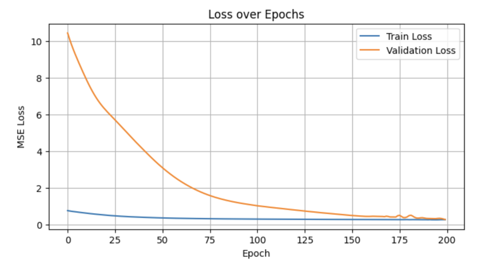
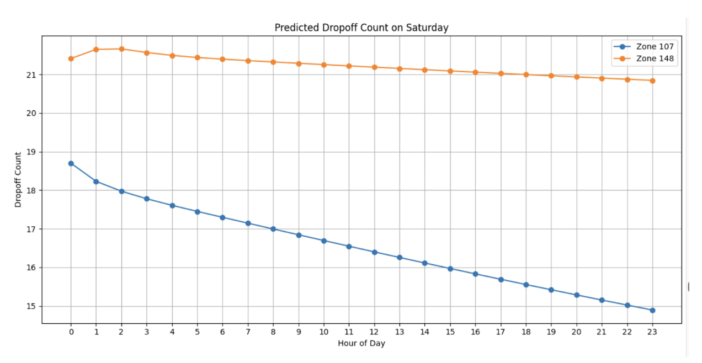

# Crowd Density Forecasting in NYC Taxi Zones

This repository contains two approaches to forecasting **crowd density** in NYC based on historical **taxi drop-off data**. The models use spatiotemporal deep learning techniques (GNNs + RNNs) to predict drop-off activity in different zones with applications in urban planning and mobility insights. 

[View the project report](GNN-RNN_CrowdDensityForecasting.pdf)

---

## Project Structure

- `crowd_forecasting.ipynb`  
  → Uses a **feature matrix per time step** with GNN + RNN to predict hourly features for each zone.  
  → Built around tabular time series and a static graph.

- `graphs_per_time.ipynb`  
  → Uses **graphs as temporal inputs**, encoding each hour as a separate graph with edge weights and node features.  
  → Processes graph sequences with GraphSAGE + RNN (GRU), predicting total drop-offs.

---

## Goals

- Predict zone-level **crowd density** (via drop-off counts).
- Capture **spatial dependencies** using GNNs.
- Capture **temporal dynamics** using RNNs.
- Evaluate performance across time, zones, and day types.

---

## Model Architectures

### 1. `crowd_forecasting.ipynb` (Tabular GNN+RNN Approach)
- **Input**: Hourly matrix of features (e.g. dropoff count, fare, weekday).
- **GNN**: GCNConv over a co-visitation graph of zones.
- **RNN**: GRU over sequences of GNN outputs.
- **Output**: Next-hour prediction of zone-level features.
- **Forecasting**: 1-step and multi-step into the future.
- **Highlights**: Simulates different days over 24 hours (e.g. Monday vs Saturday), visualizes per-zone predictions.

### 2. `graphs_per_time.ipynb` (Graph-Per-Timestep Approach)
- **Input**: Sequence of hourly graphs with edge weights and rich node features.
- **GNN**: 2-layer GraphSAGE with edge index to encode each graph.
- **RNN**: GRU over the graph sequence.
- **Output**: Predicts total drop-off count per zone.
- **Highlights**: Integrates calendar features (e.g. day of week, holiday), uses graph-level pooling.

---

## Evaluation

- **Metrics used**:
  - Mean Squared Error (MSE)
  - Mean Absolute Error (MAE)
  - Coefficient of Determination (R²)
  - Relative Error (%)
- Zone-level and time-series comparisons included.
- Distinct metrics/evaluation approaches tailored to each framework

---

## Data

- **Source**: NYC Yellow Taxi Trip Data (2017–2018) (https://www.nyc.gov/site/tlc/about/tlc-trip-record-data.page)
- **Preprocessing**:
  - Aggregation into hourly windows
  - Filtering top 50 drop-off zones
  - One-hot and sinusoidal time encodings
  - Static graph construction

---

## Results Summary

| Approach               | Strengths                                                      | Notes                                                         |
|------------------------|----------------------------------------------------------------|---------------------------------------------------------------|
| `crowd_forecasting`    | Effective at fine-grained, short-term forecasting; excels in zone-specific and intraday variations | Great for simulating day-specific effects and visualizations             |
| `graphs_per_time`      | Strong long-term generalization; captures macro-level graph dynamics in high-volume zones | Graph-based patterns help stabilize average demand prediction    |

---
Both models have strong predictive capabilities but are better in different aspects, judging from the results. Method 1 (`graphs_per_time`) excels at learning from graph patterns and long-term generalization. In high-volume zones, it performs well in predicting average demand levels accurately. In contrast, Method 2 (`crowd_forecasting`) excels in capturing fine-grained temporal and spatial variations and is effective in simulating intraday and zone-specific dynamics. This approach is well-suited for day-specific forecasting and visualization.

## Contributers

Julia Novick and Eirini Schoinas
